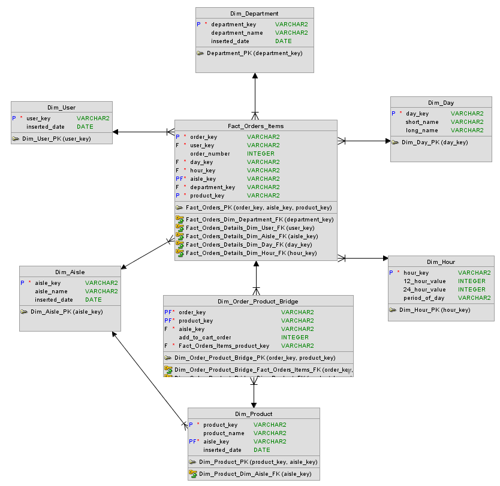
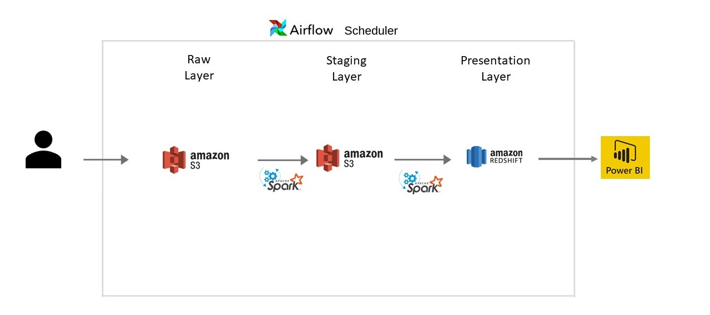
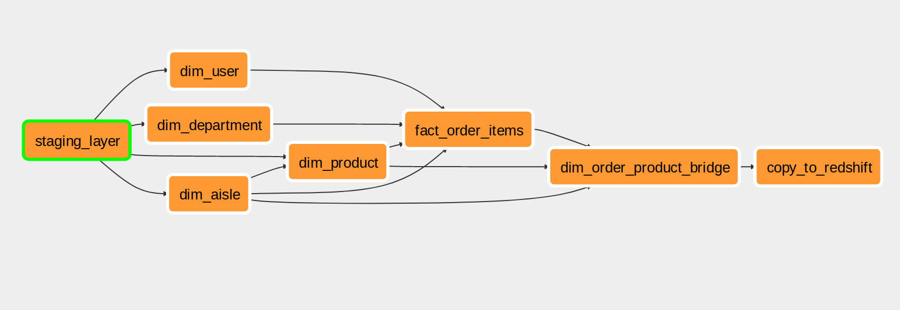
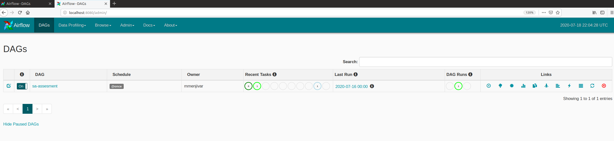

# AS - Technical Assesment
The objective of the project is build a dimensional model to provide insights to the business. The data sources are a csv and a json file placed in the S3 Raw Layer. All the pipeline files have been written in Python for the Pyspark.

## Content
1. [Important Links](#important-links)
2. [About the Data Model](#about-the-data-model)
    1. [Dimensional Model](#dimensional-model)
    2. [Data Dictionary Presentation Layer](#data-dictionary-presentation-layer)
        1. [Dim Department](#dim-department)
        2. [Dim Aisle](#dim-aisle)
        3. [Dim User](#dim-user)
        4. [Dim Product](#dim-product)
        5. [Dim Order Product Bridge](#dim-order-product-bridge)
        6. [Dim Day](#dim-day)
        7. [Dim Hour](#dim-hour)
        8. [Fact Order Items](#fact-order-items)
    3. [Data Dictionary Staging Layer](#data-dictionary-staging-layer)
        1. [Staging Orders](#staging-orders)
        2. [Staging Products](#staging-products)
    4. [Data Dictionary Raw Layer](#data-dictionary-raw-layer)
        1. [Orders](#orders)
        2. [Products](#products)
5. [About the Project Structure](#about-the-project-structure)
6. [Data Arquitecture](#data-arquitecture)
    1. [Raw Layer](#raw-layer)
    2. [Staging Layer](#staging-layer)
    3. [Presentation Layer](#presentation-layer)
7. [About the Data Pipeline](#about-the-data-pipeline)
    1. [DAG and Task Example](#dag-and-task-example)
    2. [Task dependencies](#task-dependencies)
8. [How to Deploy](#how-to-deploy)
    1. [Requirements](#deploy-requirements)
    2. [Steps](#steps)
    3. [Demo Virtual Box](#demo-virtualbox)
    4. [Requirements](#requirements)
    5. [Running Airflow](#running-airflow)
    6. [Running the DAG](#running-the-dag)

<a name="important-links"></a>
## Important Links
 - [PowerBi Dashboard](https://app.powerbi.com/view?r=eyJrIjoiNWUxYWY1ZWEtNjBmMi00OThmLWE2MjUtYmFhZjYwMTg0NjI5IiwidCI6ImRlNTIzZmMwLWNjNTctNGFlNS04YzhjLTAxZWFkMjEyYWIzMyJ9&pageName=ReportSection39315b7f5918d041c2ba)
 - [Drive Resources Folder](https://tiuesedusv-my.sharepoint.com/:f:/g/personal/marlon_menjivar_ti_ues_edu_sv/EuKYgWRbYR5Hl7XL02GBvg4BmJMpBa3eqFEeBhm_jgOTpg?e=GgfK69)

<a name="about-the-data-model"></a>
## About the Data Model
<a name="dimensional-model"></a>
### Dimensional Model
The business requirements have been transformed in the next Kimball Star:



<a name="data-dictionary-presentation-layer"></a>
### Data Dictionary Presentation Layer
The Presentation Layer is where the data has been processed and has the final format. Could be found in S3-Bucket/presentation_layer in PARQUET format or exposed in the Redshift schema.
#### Dim Department
Catalog for all the departments in the dataset. 
- **Granularity**: One record per department.
- **Distribution Policy**: The distribution is *Auto* let's redshift decide how to distribute this table based on the size.
- **Uniqueness Policy**: The etl search for new records every incremental load and append them if exists. A new key is generated.
- **ETL Script**: [dim-department.py](dimensionsProcess/dim-department.py)
- **S3 Location:** {S3-bucket}/presentation_layer/dim_department
- **Redshift Table:** dim_department

| Column Name     | Type   | Source                      | Comment                                     | Sample                              |
|-----------------|--------|-----------------------------|---------------------------------------------|-------------------------------------|
| department_key  | String | -                           | Surrogate Key Generated                     | 68d2e3f-6e13-463a-9048-bbb85acc076e |
| department_name | String | products.json => department |                                             | frozen                              |
| inserted_date   | Date   | -                           | Execution Date where the record is inserted | 2020/07/17                          |

#### Dim Aisle
Catalog for all the departments in the dataset.
- **Granularity**: One record per aisle. 
- **Distribution Policy**: The distribution is *Auto* let's redshift decide how to distribute this table based on the size.
- **Uniqueness Policy**: The etl search for new records every incremental load and append them if exists. A new key is generated.
- **ETL Script**: [dim-aisle.py](dimensionsProcess/dim-aisle.py)
- **S3 Location:** {S3-bucket}/presentation_layer/dim_aisle
- **Redshift Table:** dim_aisle


| Column Name   | Type   | Source                 | Comment                                     | Sample                              |
|---------------|--------|------------------------|---------------------------------------------|-------------------------------------|
| aisle_key     | String | -                      | Surrogate Key Generated                     | 68d2e3f-6e13-463a-9048-bbb85acc076e |
| airley_name   | String | products.json => aisle |                                             | asian foods                         |
| inserted_date | Date   | -                      | Execution Date where the record is inserted | 2020/07/17                          |

#### Dim User
Catalog for all the aisles in the dataset. The structure enables the extension and enrichment of future requirements on users, as distribution by age or gender. 
- **Granularity**: One record per user.
- **Distribution Policy**: The distribution is *Auto* let's redshift decide how to distribute this table based on the size
- **Uniqueness Policy**: The etl search for new records every incremental load and append them if exists. A new key is generated.
- **ETL Script**: [dim-user.py](dimensionsProcess/dim-user.py)
- **S3 Location:** {S3-bucket}/presentation_layer/dim_user
- **Redshift Table:** dim_user


| Column Name   | Type   | Source                 | Comment                                     | Sample     |
|---------------|--------|------------------------|---------------------------------------------|------------|
| user_key      | String | dataset.csv => USER_ID | Surrogate Key                               | 132366     |
| inserted_date | Date   | -                      | Execution Date where the record is inserted | 2020/07/17 |

#### Dim Product
Catalog for all the products in the dataset. The structure enables the extension and enrichment of future requirements on products, as size, brand, etc. 
- **Granularity**: One record per product per aisle.
- **Distribution Policy**: The Distribution Key is aisley_key to keep the data related to an specific aisle in the same node and avoid data movement.
- **Uniqueness Policy**: The etl search for new records every incremental load and append them if exists. A new key is generated.
- **ETL Script**: [dim-product.py](dimensionsProcess/dim-product.py)
- **S3 Location:** {S3-bucket}/presentation_layer/dim_product
- **Redshift Table:** dim_product


| Column Name   | Type   | Source                   | Comment                                     | Sample                              |
|---------------|--------|--------------------------|---------------------------------------------|-------------------------------------|
| product_key   | String | -                        | Surrogate Key Generated                     | 68d2e3f-6e13-463a-9048-bbb85acc076e |
| aisle_key     | String | dim_aisle.aisle_key      | Foreign Key pointing to dim_aisle           | 68d2e3f-6e13-463a-9048-bbb85acc075r |
| product_name  | String | products.json => PRODUCT |                                             | Dark Chocolate Truffles             |
| inserted_date | Date   | -                        | Execution Date where the record is inserted | 2020/07/17                          |

#### Dim Order Product Bridge
Bridge to hold the *Add to cart order* of a product in an order.
- **Granularity**: One record per item per order.
- **Distribution Policy**: The Distribution Key is aisley_key to keep the data related to an specific aisle in the same node and avoid data movement.
- **Uniqueness Policy**: the etl builds the bridge based on new records every incremental load and append them if exists.
- **ETL Script**: [dim-order-product-bridge.py](dimensionsProcess/dim_order_product_bridge.py)
- **S3 Location:** {S3-bucket}/presentation_layer/dim_order_product_bridge
- **Redshift Table:** dim_order_product_bridge

| Column Name       | Type    | Source                        | Comment                                 | Sample                              |
|-------------------|---------|-------------------------------|-----------------------------------------|-------------------------------------|
| order_key         | String  | dataset.csv ORDER_ID          | Foreig Key pointing to fact_order_items | 2703983                             |
| product_key       | String  | dim_product.product_key       | Foreign Key pointing to dim_product     | 68d2e3f-6e13-463a-9048-bbb85acc076e |
| aisle_key         | String  | dim_aisle.aisle_key           | Foreign Key pointing to dim_aisle       | 68d2e3f-6e13-463a-9048-bbb85acc075r |
| add_to_cart_order | Integer | dataset.csv ADD_TO_CART_ORDER |                                         | 1                                   |

#### Dim Day
Dimension to store day data related.
- **Granularity**: One record per day of the week.
- **Distribution Policy**: The distribution is *Auto* let's redshift decide how to distribute this table based on the size.
- **Uniqueness Policy**: A record per day in the week.
- **ETL Script**: ETL-less dimension, inserts in redshift could be found [here](commonFunctions/rs_creation_tables.sql)
- **S3 Location:** Not stored in S3
- **Redshift Table:** dim_day

| Column Name | Type   | Source | Comment               | Sample |
|-------------|--------|--------|-----------------------|--------|
| day_key     | String | -      | Primary Key           | 0      |
| short_name  | String | -      | Short name of the day | Su     |
| long_name   | String | -      | Long name of the day  | Sunday |

#### Dim Hour
Dimension to store hour data related.
- **Granularity**: One record per hour of the day.
- **Distribution Policy**: The distribution is *Auto* let's redshift decide how to distribute this table based on the size.
- **Uniqueness Policy**: A record per hour in the day.
- **ETL Script**: ETL-less dimension, inserts in redshift could be found [here](commonFunctions/rs_creation_tables.sql)
- **S3 Location:** Not stored in S3
- **Redshift Table:** dim_hour

| Column Name           | Type   | Source | Comment             | Sample        |
|-----------------------|--------|--------|---------------------|---------------|
| hour_key              | String | -      | Primary Key         | 01            |
| twelve_hour_value     | String | -      | 12 hour hour format | 1am           |
| twentyfour_hour_value | String | -      | 24 hour format      | 1             |
| period_of_day         | String | -      | -                   | Early morning |

#### Fact Order Items
Fact-less Fact Table, to store and join all the related data of an order.
- **Granularity**: One record per item per order
- **Distribution Policy**: The Distribution Key is aisley_key to keep the data related to an specific aisle in the same node and avoid data movement.
- **Uniqueness Policy**: The etl builds the fact based on new orders every incremental load and append them if exists.
- **ETL Script**: [fact-order-items.py](factProcess/fact-order-items.py)
- **S3 Location:** {S3-bucket}/presentation_layer/fact_order_items
- **Redshift Table:** fact_order_items

| Column Name    | Type   | Source                           | Comment                                                      | Sample                              |
|----------------|--------|----------------------------------|--------------------------------------------------------------|-------------------------------------|
| order_key      | String | dataset.csv => ORDER_ID          | Part of the compound PK                                      | 1649863                             |
| user_key       | String | dataset.csv => USER_ID           | Foreign key pointing to dim_user                             | 99658                               |
| order_number   | String | dataset.csv => ORDER_NUMBER      | Natural Key, Part of the compound PK                         | 4                                   |
| day_key        | String | dataset.csv => ORDER_DOW         | Foreign key pointing to dim_day                              | 1                                   |
| hour_key       | String | dataset.csv => ORDER_HOUR_OF_DAY | Foreign key pointing to dim_hour                             | 02                                  |
| aisle_key      | String | dim_aisle.aisle_key              | Foreing key pointing to dim_aise                             | 68d2e3f-6e13-463a-9048-bbb85acc076e |
| department_key | String | dim_department.department_key    | Foreing key pointing to dim_department                       | 68d2e3f-6e13-463a-9048-bbb85acc0efg |
| product_key    | String | dim_produdct.product_key         | Foreign key pointing to dim_product, Part of the compound PK | 68d2e3f-6e13-463a-9048-bbb85accertq |

## Data Dictionary Staging Layer
The staging layer it's a partition in the S3 bucket to store pre-processed data. The location is S3-Bucket/staging_layer

#### Satging Orders
Staging Table to store pre-processed orders
- **Granularity**: One record per item per order
- **ETL Script**: [staging-transformations.py](commonFunctions/staging-transformations.py)
- **S3 Location**: {S3-Bucket}/staging_layer/orders
- **Format:** Parquet
- **Persistencty:** Overwritten every run

| Column Name       | Type    | Source                           | Comment                                     | Sample              |
|-------------------|---------|----------------------------------|---------------------------------------------|---------------------|
| ORDER_ID          | String  | dataset.csv => ORDER_ID          |                                             | 1649863             |
| USER_ID           | String  | dataset.csv => USER_ID           |                                             | 99658               |
| ORDER_NUMBER      | String  | dataset.csv => ORDER_NUMBER      |                                             | 4                   |
| ORDER_DOW         | String  | dataset.csv => ORDER_DOW         |                                             | 3                   |
| ORDER_HOUR_OF_DAY | String  | dataset.csv => ORDER_HOUR_OF_DAY |                                             | 13                  |
| PRODUCT           | String  | dataset.csv => ORDER_DETAILS     | Transformation applied to parse the details | Almond Chia Granola |
| AISLES            | String  | dataset.csv => ORDER_DETAILS     | Transformation applied to parse the details | granola             |
| ADD_TO_CART_ORDER | Integer | dataset.csv => ORDER_DETAILS     | Transformation applied to parse the details | 1                   |

#### Staging Products
Staging Table to store pre-processed products
- **Granularity**: One record per product
- **ETL Script**: [staging-transformations.py](commonFunctions/staging-transformations.py)
- **S3 Location**: {S3-Bucket}/staging_layer/products
- **Format**: Parquet
- **Persistencty:** Overwritten every run

| Column Name  | Type   | Source        | Comment                            | Sample                        |
|--------------|--------|---------------|------------------------------------|-------------------------------|
| product_name | String | products.json | Json transformed to tabular format | Hershey's Chocolate Creme Pie |
| aisle        | String | products.json | Json transformed to tabular format | ice cream ice                 |
| department   | String | products.json | Json transformed to tabular format | frozen                        |


## Data Dictionary Raw Layer
The raw layer is a partition in the S3 bucket to store original data without transformations. The location is S3-Bucket/raw_layer. The files to be processed should be put here.

#### Orders
- **Granularity**: One record per order
- **S3 Location**: {S3-Bucket}/raw_layer/{file_name.csv}
- **Format**: CSV
- **Persistencty:** Must be uploaded manually to the Bucket, could replace the last one.

| Column Name             | Type    | Source                           | Comment                                                                       | Sample              |
|-------------------------|---------|----------------------------------|-------------------------------------------------------------------------------|---------------------|
| ORDER_ID                | String  | dataset.csv => ORDER_ID          |                                                                               | 1649863             |
| USER_ID                 | String  | dataset.csv => USER_ID           |                                                                               | 99658               |
| ORDER_NUMBER            | String  | dataset.csv => ORDER_NUMBER      |                                                                               | 4                   |
| ORDER_DOW               | String  | dataset.csv => ORDER_DOW         |                                                                               | 3                   |
| ORDER_HOUR_OF_DAY       | String  | dataset.csv => ORDER_HOUR_OF_DAY |                                                                               | 13                  |
| ORDER_DETAILS           | String  | dataset.csv => ORDER_DETAILS     | Order details, each product separeted by ~ and every product detail by a pipe | Almond Chia Granola |


#### Products
- **S3 Location**: {S3-Bucket}/raw_layer/{file_name.csv}
- **Format**: CSV
- **Persistencty:** Must be uploaded manually to the Bucket, could replace the last one.

```
root
 |-- results: array
 |    |-- element: struct
 |    |    |-- columns:
 |    |    |    |-- element: struct
 |    |    |    |    |-- name: string
 |    |    |    |    |-- type: string
 |    |    |-- items: array
 |    |    |    |-- element: struct
 |    |    |    |    |-- aisle: string
 |    |    |    |    |-- department: string
 |    |    |    |    |-- product_name: string
```

## About the Project Structure
- **commonFunctions Module:** Common .py scripts used in the etl's
- **dimensionProcess Module:** Contains all the scripts for dimensions
- **factProcess Module:** Contains the script for the fact table
- **redshiftCopyProcess:** Contains the script to copy to redshift
- **as-assesment-dag.py:** Airflow dag file
- **dl.cfg:** Configuration file

## Data Arquitecture
The arquitecture is divided in 3 layer with different purposes and technologies:



### Raw Layer
S3 Partition, the user has to upload manually the files to process and update the confgiruation file with the new names.

### Staging Layer
- **S3** for data storage
- **Spark** to run massive data transformations
- **Python** to write transformations

### Presentation Layer
- **S3** for data storage
- **Redshift** for data exposition
- **Spark** to run massive data transformations
- **Python** to write transformations
- **Power Bi** to consume the data and build dashboards

## About the Data Pipeline

### DAG and Task Example
The tool chosen for schedule the etl processes, manage tasks dependencies, retries. logs and security is Apache Airflow, please find more about the tool [here](https://airflow.apache.org/).
 


All the steps are using the *Airflow Spark Submit Operator*. The operator is in charge to send the .py script to the spark cluster managing the connection trough airflow. Let's see an example of a task implemented:

```python
staging_layer=SparkSubmitOperator(
	task_id='staging_layer',
	application = '/home/mmenjivar/SA-Assesment/commonFunctions/staging-transformations.py',
	conn_id = 'spark-local',
	py_files='/home/mmenjivar/SA-Assesment/commonFunctions.zip',
	dag = dag,	
)
```
- **Task Id:** Unique name of the task in the Airflow DAG (Direct Acyclic Graph)
- **Application:** Python Script to send to Spark Cluster
- **Conn Id (Connection Id):** Spark Cluster connection created in the airflow administration
- **Py Files:** Additional resources the script needs to run
- **DAG:** Name of the DAG you want to assign the task

### Task Dependencies
As it's shown in the diagram, Airflow is very useful to handle dependencies in task like *Don't start if the task B hasn't finished*. The dependencies in the DAG are:

- **dim_order_product_bridge:** dim_product, dim_aisle, fact_order_items
- **dim_aisle:** staging_layer
- **dim_department:** staging_layer
- **dim_product:** dim_aisle, staging_layer
- **dim_user:** staging_layer
- **fact_order_items:** dim_aisle, dim_department, dim_user, dim_product
- **copy_to_redshift:** dim_order_product_bridge

## How to deploy
#### Deploy Requirements:
- Python 2.7 or major
- Airflow 1.10.2 or major
- Spark Cluster 2.x
- Redshift Cluster
- S3 Bucket configured

#### Steps
1. Copy the project folders to the server running Airflow
2. Complete the [configuration file](dl.cfg) with your credentials.
3. If you move the [configuration file](dl.cfg) you may need to update the reference in the .py files
4. Copy the [Dag File](as-assesment-dag.py) to the *airflow/dags* folder, update the .py location and the connection id of the Spark Cluster if is needed
5. Create the Spark Connection in the Airflow admin interface
6. Turn on the DAG
7. Uptade the raw file names in the [configuration file](dl.cfg)
8. Choose 'full' for initial load or 'incremental' in the [configuration file](dl.cfg)

#### Demo VirtualBox
For demo purposes I've configured an Ubuntu image running all the tools you need to see the dag in action, please find the download link in the [Important Links Section](#important-links).

##### Requirements:
- Oracle Virtual Box 6.1
- 32Gb Ram
- 30Gb HDD Free Space

##### Running Airflow
- Login in the user *mmenjivar* with the pass *114i2012mm10020*
- Start airflow webserver:
     ```> airflow webserver```
- Start airflow scheduler:
     ```> airflow scheduler```
- Access Airflow with the addres: http://localhost:8080/
- Enjoy the views!



##### Running the DAG
1. Be sure that the DAG is on.
2. In the links Column click on the *Trigger Dag* Button
3. The dag will start and the task are going to be executed following the dependencies.